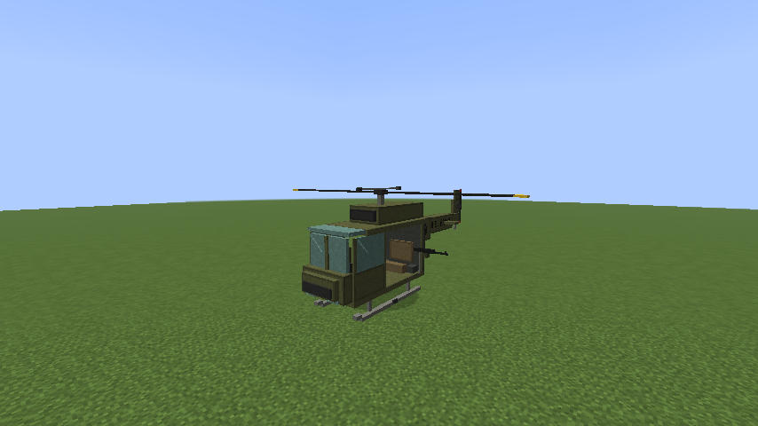
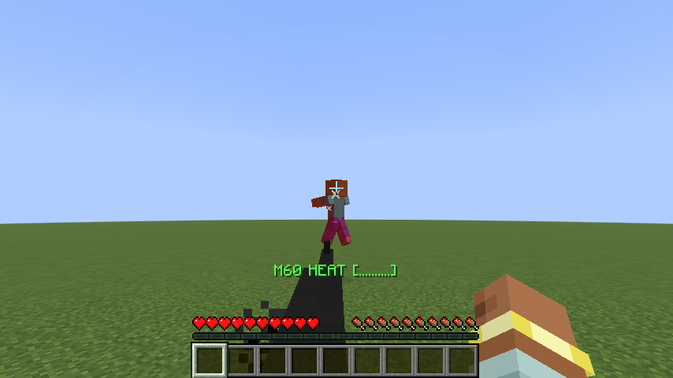
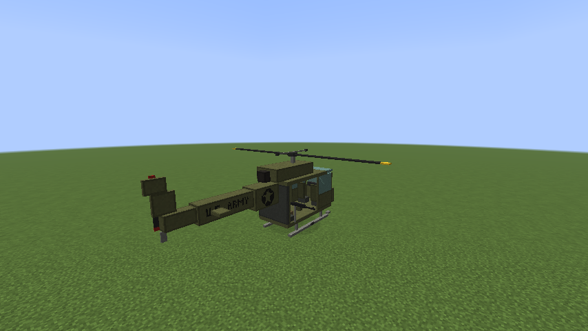

# Huey Helicopter

A flyable **Bell UH-1 "Huey"** for Minecraft (Fabric). Bring your squad: a pilot, a copilot, two M60 door gunners, and four more troops can ride together.



| | |
|---|---|
|  |  |

> 📖 **Full step-by-step guide:** [GUIDE.md](GUIDE.md) (or the printable [PDF](docs/Huey-Helicopter-Guide.pdf)). It covers installing, boarding, flying, door guns and troubleshooting. You can also hand the guide to an AI assistant (ChatGPT, Claude and so on) and it will coach you through it.

## Features

- **Flyable, arcade-style.** The rotor spins up over about 4 seconds, then you can lift off, hover hands-free, fly forward with the nose tilted down, and bank into turns.
- **8 seats:** pilot, copilot, left and right door gunners, two troop-bench seats, and two "legs out the door" seats.
- **M60 door guns.** Gunners hold left-click to fire, with red tracers. The guns swing to follow where the gunner looks, and they overheat if you hold the trigger too long.
- **The whop-whop.** The rotor sound carries about 80 blocks, so your squad hears you coming.
- **Solid multiplayer.** It uses Minecraft's built-in vehicle syncing (the same system as boats), so there's no jitter, and servers won't kick the pilot for "flying."
- **Hull damage.** Take too much fire and the Huey goes down. Right-click it with an iron ingot to patch it up.
- Only needs **Fabric API**. No other libraries.

## Controls

| Who | Key | Does |
|---|---|---|
| Anyone | **Right-click** the Huey | Climb aboard (crew seats fill first) |
| Anyone | **G** | Switch to the next free seat (rebind in Controls → Huey Helicopter) |
| Anyone | **Shift** | Jump out (in flight you'll fall, so good luck) |
| Pilot | **W / S** | Fly forward / back |
| Pilot | **A / D** | Turn left / right |
| Pilot | **Space** | Climb |
| Pilot | **Ctrl** (your Sprint key) | Descend |
| Door gunner | **Hold left-click** | Fire the M60 |
| On foot | **Right-click with an iron ingot** | Repair 10 hull points |

The pilot's action bar shows rotor RPM, altitude, speed and hull. Gunners see their barrel heat.

## Getting a Huey

Creative mode: it's in the **Tools & Utilities** tab.

Survival: craft it.

```
[ Iron Bars ] [ Iron Bars  ] [ Iron Bars      ]
[ Glass Pane] [ Iron Block ] [ Redstone Block ]
[ Iron Block] [Blast Furnace] [ Iron Block    ]
```

Right-click the ground with the item to deploy it. It faces the way you're looking. To pick it back up, break it by hitting it in Survival (you get the item back) or with one hit in Creative.

## Installing

> **Version matters.** This branch is for **Minecraft 1.21.11**. (A 26.3 build lives on the `main` branch.) The server and every player must be on the same Minecraft version and the same Huey release, or you'll be refused when you join.

### Playing on a Lunar Client Hosted World

If your group plays on a Lunar **Hosted World** (an address like `yourname.lunarclient.world`), there is no separate server to set up. The host's own Lunar Client runs the world.

1. **Everyone, including the host:** open Lunar Client, choose **1.21.11** with the **Fabric** add-on enabled, open the **Mods** window, and drag in `huey-helicopter-0.1.0+mc1.21.11.jar`. Lunar's Fabric add-on already includes Fabric API. Only add a Fabric API jar yourself if Lunar says it's missing.
2. **The host** launches the game, opens the world and hosts it as usual.
3. **Friends** join the `yourname.lunarclient.world` address as usual.

If anyone is missing the mod, they can't join, so make sure the whole squad has it.

### For the server owner

1. The server must be a **Fabric** server for Minecraft 1.21.11. Paper and Spigot servers can't load Fabric mods. If yours isn't Fabric yet, use the free server installer at <https://fabricmc.net/use/server/>. Your existing world carries over.
2. Download **Fabric API** for 1.21.11 from <https://modrinth.com/mod/fabric-api> and put it in the server's `mods` folder (if it isn't there already).
3. Download `huey-helicopter-<version>+mc1.21.11.jar` from this project's [Releases page](../../releases) and put it in the same `mods` folder.
4. Restart the server.

### For each player

Everyone who joins needs the mod too, because the 3D model, sounds and controls run on your own computer.

1. Install **Fabric Loader** for Minecraft 1.21.11 from <https://fabricmc.net/use/installer/>, or use a launcher that handles it for you (Prism Launcher, the Modrinth App, or CurseForge).
2. Put **Fabric API** and the **Huey jar** in your `mods` folder.
3. Launch the Fabric profile and join the server.

**Lunar Client:** Lunar can load Fabric mods through its Fabric add-on. Check that Lunar offers Fabric for your server's Minecraft version first, then drag the Huey jar into Lunar's Mods window.

## Building from source

Needs a Java 25 JDK to build (the finished mod runs on Java 21).

```bash
./gradlew build              # jar lands in build/libs/
./gradlew runClient          # launch a test copy of Minecraft with the mod
./gradlew runServer          # launch a local test server
./gradlew runClientGameTest  # automated in-game test: flies the Huey, fires the guns, takes screenshots
```

The 3D model and texture are generated by `tools/gen_model.py`, and the sounds and icons by `tools/gen_assets.py`. Edit those scripts and re-run them rather than editing the generated files by hand. Everything is original, so there are no third-party assets.

## License

MIT. See [LICENSE](LICENSE). Use it, fork it, and add your own Chinook.
